## Alt School Second Semester Project Documentation

## Question

“Imagine you are part of a startup team tasked with creating a prototype for a web application. Your first step is to provision a server and set up a simple landing page to demonstrate your team’s capabilities to potential investors. Your task is as follows:”

### Provisioning the Server:

* Use any virtualization or cloud platform (AWS.) to set up a Linux server.
* Install a Linux distribution of your choice (e.g., Ubuntu).

### Web Server Setup:
* Install a web server (e.g., Apache, Nginx) to serve web content.

### HTML Page Deployment:
- Create a simple HTML page with the following  information: 

  - Your name.
  - A project title: “Welcome to [Your Name] Landing Page.”
  - A brief description of your project.
  - Your full bio with every interesting information about you
  - Deploy the HTML page on the server.

### Networking:

- Configure the server to allow HTTP traffic (port 80).
Provide the public IP address (or URL if using DNS) so your page can be accessed from any browser.

### Deliverables:
- The public IP address or URL of your web page.
- A screenshot showing your HTML page in a browser.
- Write clear, step-by-step documentation of how you provisioned the server, installed the web server, deployed the HTML page, and configured networking.

### Bonus Tasks (Optional for Extra Credit):
- Configure HTTPS for your web server using a free SSL certificate (e.g., Let’s Encrypt).

### Provisioning the Server:

* Use any virtualization or cloud platform (AWS.) to set up a Linux server.

I will be using AWS cloud to provision my server to setup my webpage on the cloud:

- Login to my AWS console to configure and create ubuntu server as required. 

* Install a Linux distribution of your choice (e.g., Ubuntu).

I would be provisioning and configuring Ubuntu server using AWS intance. 
Ubuntu server succesfully provisioned with public, private IP and DNS. 

### Web Server Setup:
* Install a web server (e.g., Apache, Nginx) to serve web content.

I would be connecting to the Ubuntu server using termius to install and configure Apache web server to serve my webpage content. 

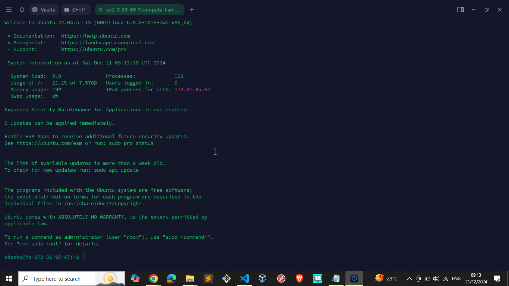

I would be runing the following commands to intall and configure my Apache server. 

I first change directory to root directory with the command below:

Command: sudo su -

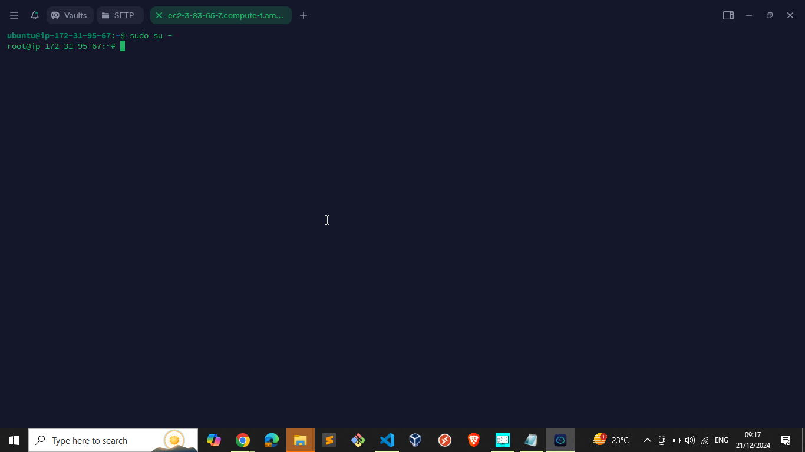

I update the server with the command below to install all the neccessary update to install my Apache and web page using the command below:

Command: apt update -y

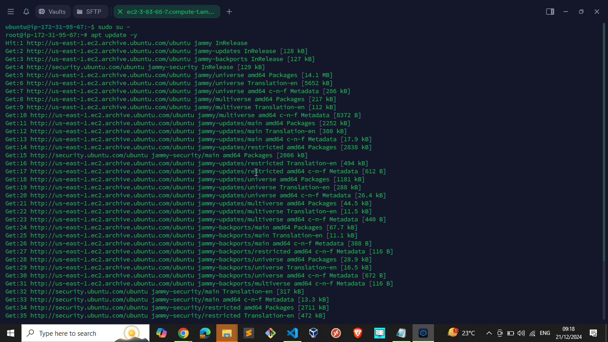

Update completed:

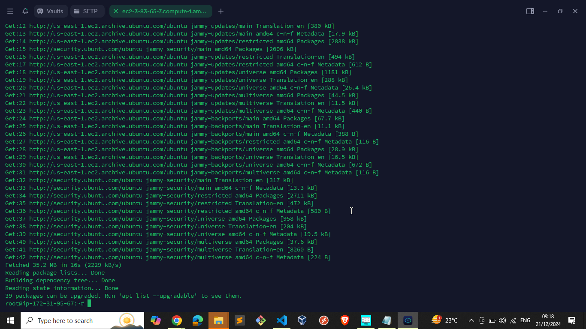

I would be installing Apache with the command below:

apt install -y apache2

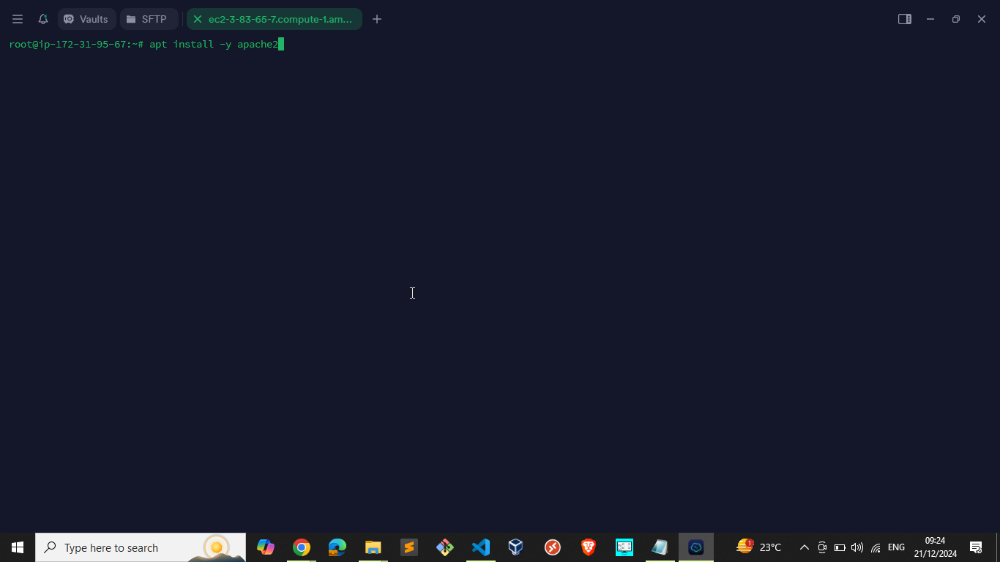

Apache installation completed:

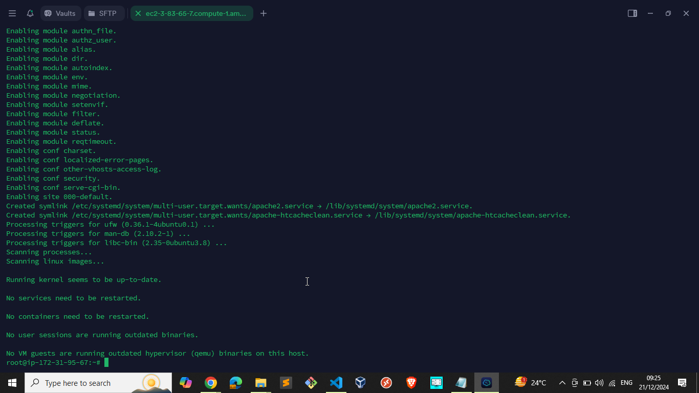

Check System status witht he following command to be sure the system is active:

systemctl status apache2

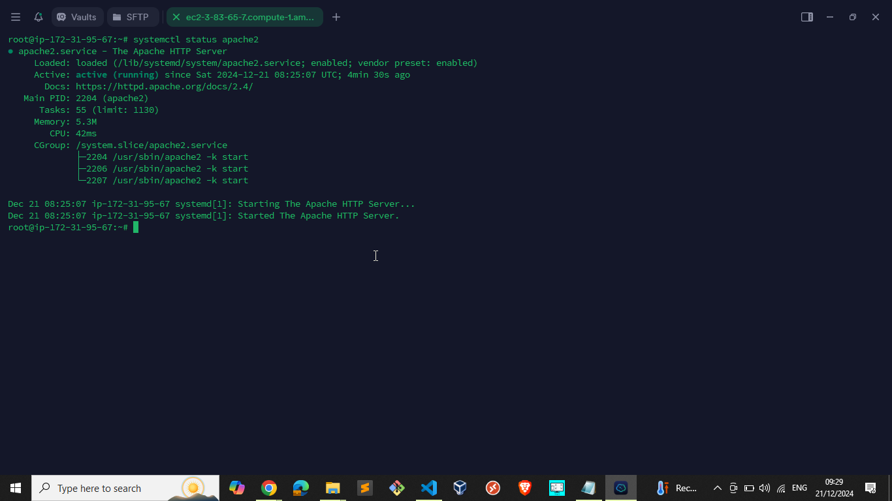

Create project directory and cd to the project director. 

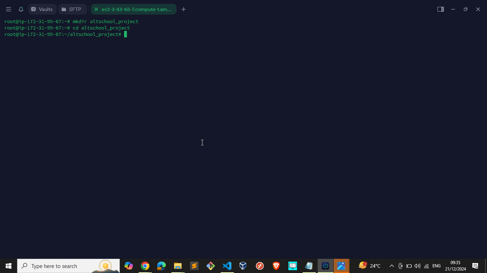

### HTML Page Deployment:
- Create a simple HTML page with the following  information: 

  - Your name.
  - A project title: “Welcome to [Your Name] Landing Page.”
  - A brief description of your project.
  - Your full bio with every interesting information about you
  - Deploy the HTML page on the server.

  I will be deploying my CV webpage already push to my GitHub account repository. 

Copy and install my github project link to my ubuntu server using the command: 
wget https://github.com/Akinwale09/AltSchool-Second-Semester-Project.git

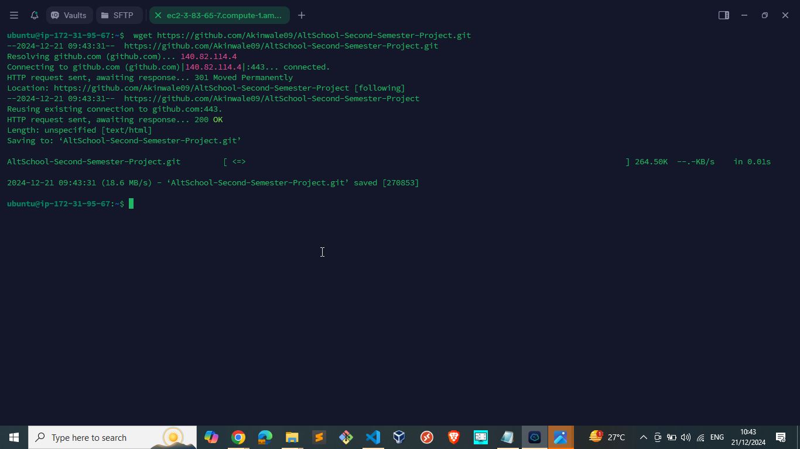

Copy and install the GitHub zip link: https://github.com/Akinwale09/AltSchool-Second-Semester-Project/archive/refs/heads/main.zip

Confirm the files in the directory using command:

ls -lrt

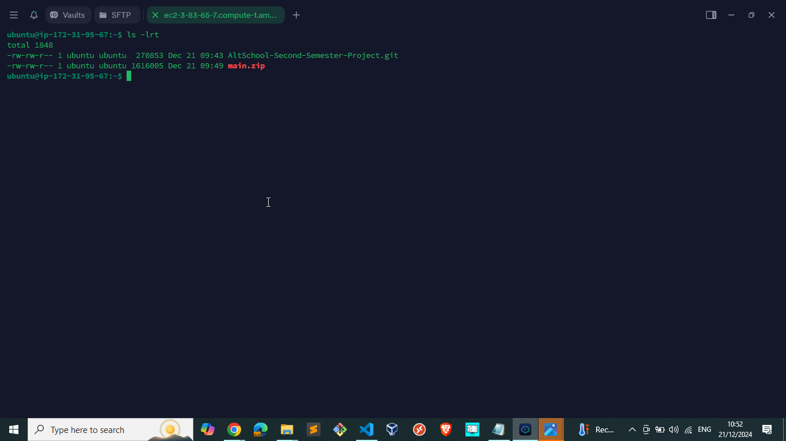

To unzip the zip folder use the command below:

apt install unzip

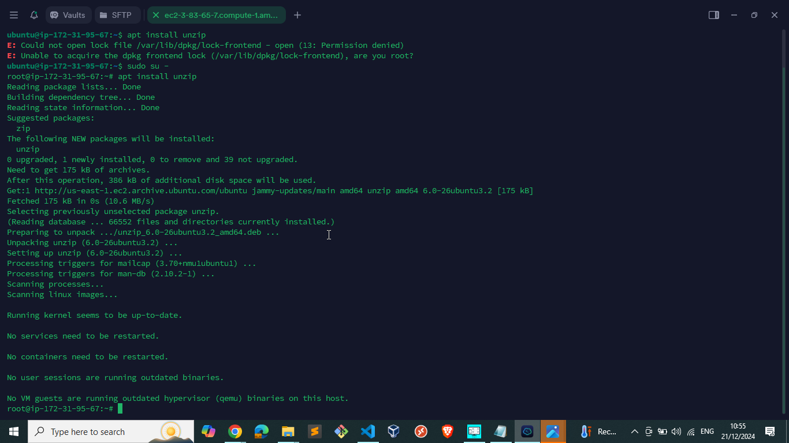

Unzip the folder main.zip with command:
unzip main.zip

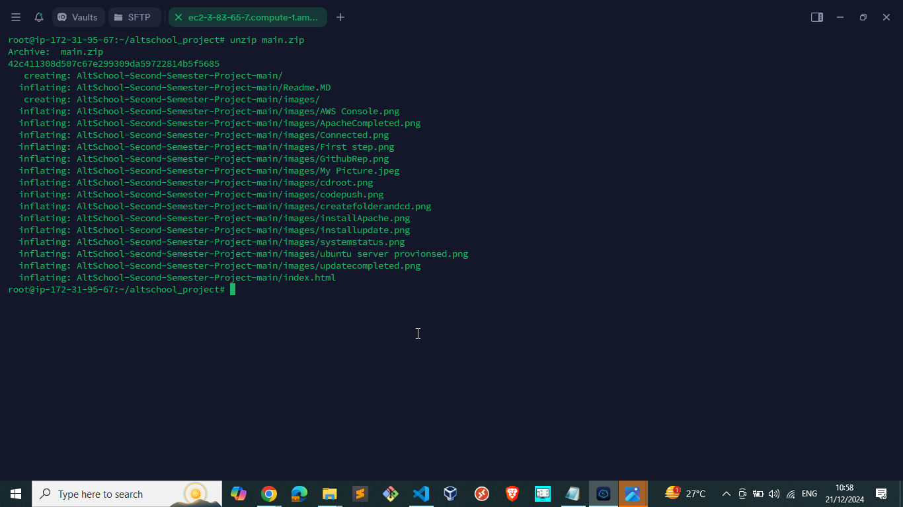

to check the file in the directory
ls -lrt 

change directory using
cd AltSchool-Second-Semester-Project-main

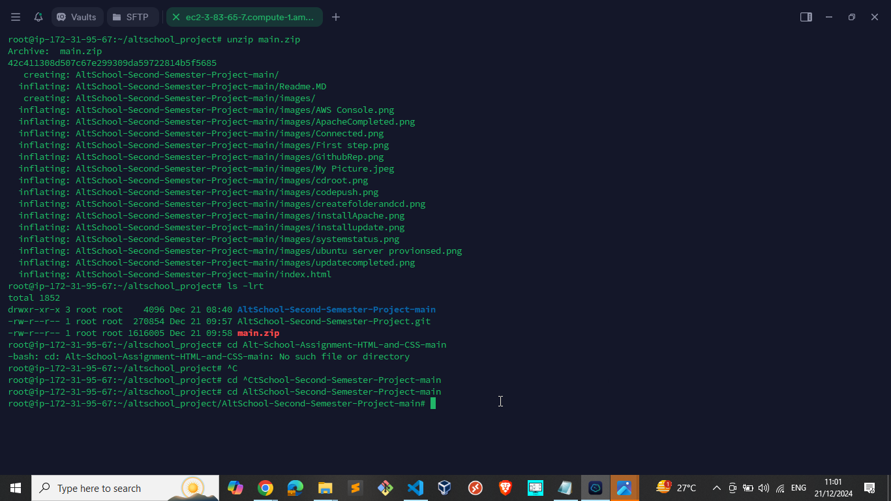

ls -lrt

Move all the files from AltSchool-Second-Semester-Project-main to /var/www/html using comaand below:

mv * /var/www/html/

cd /var/www/html/

ls -lrt

systemctl status apache2

systemctl enable apache2

systemctl start apache2

### Networking:

- Configure the server to allow HTTP traffic (port 80).
Provide the public IP address (or URL if using DNS) so your page can be accessed from any browser.

I edit my inbound security group to make my webpage accessible to all:

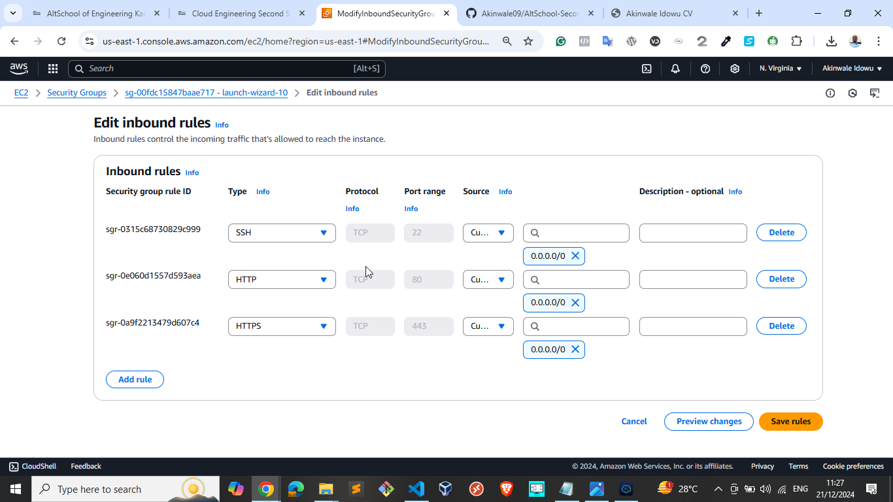

Let check my web server using the public IP address:

3.83.65.7
my webpage redering 

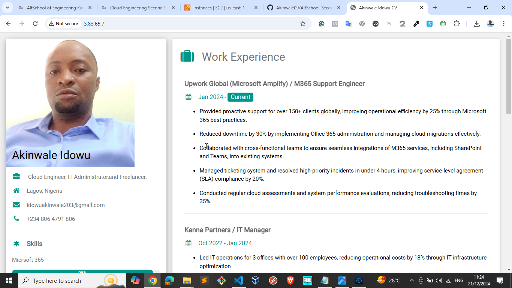

### Bonus Tasks (Optional for Extra Credit):
- Configure HTTPS for your web server using a free SSL certificate (e.g., Let’s Encrypt).

Change my IP address to resolve to my domain name:

3.83.65.7 => akinwaleidowu.world

I will request for AWS certificate manager and configure A record. 

Configure A rocord and CNAME record

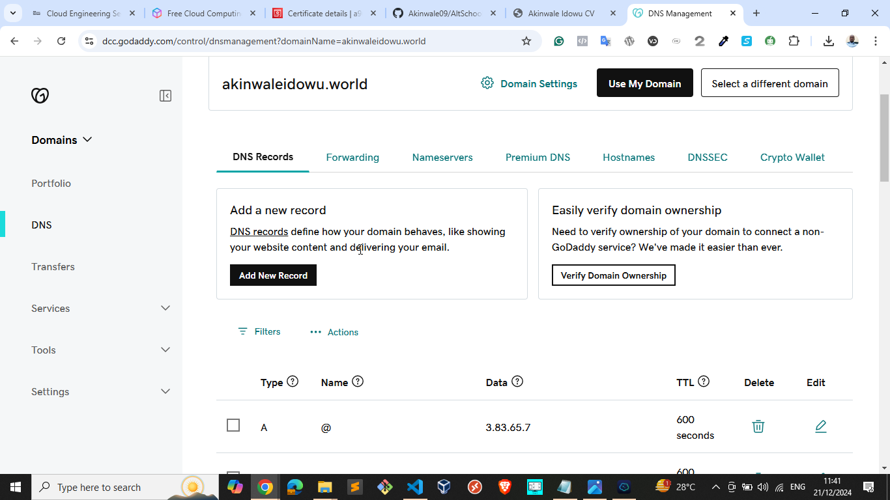

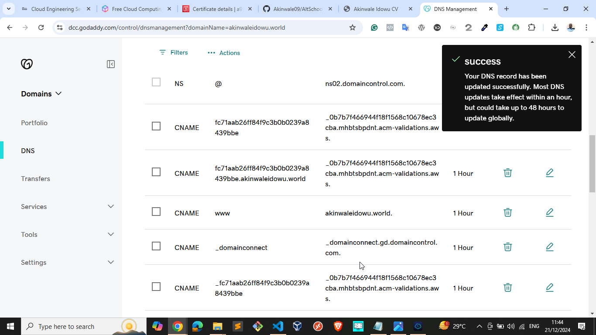
